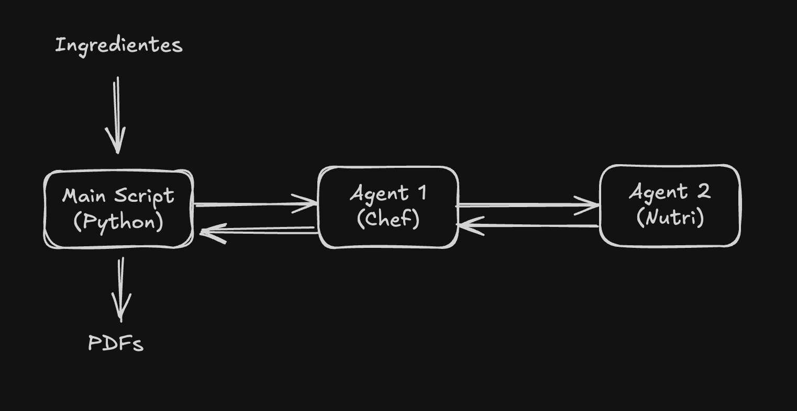

# Sorobo Chef Agent


---

## Sorobô Chef Nutrition Lab

Um assistente culinário inteligente baseado em multi-agentes que transforma ingredientes (ou o que sobrou na geladeira) em receitas completas e produz uma análise nutricional automática usando Azure AI Agents.

---

## Resumo da Aplicação

O Sorobô Chef Nutrition Lab é uma aplicação Python que:

- Recebe ingredientes informados pelo usuário.
- Gera uma receita completa em Markdown usando o **Agent 1 – Sorobô Chef**.
- Envia essa receita para o **Agent 2 – Nutri Agent**, que analisa e gera:
  - calorias estimadas
  - macronutrientes
  - alergênicos
  - pontos positivos e negativos
- Gera dois PDFs formatados contendo:
  - Receita
  - Informações nutricionais da receita


---

### Preview

[Preview do Projeto](https://youtu.be/Bx42Z1Oh4kI)


---

## Arquitetura de Agentes

### Agent 1 — Sorobô Chef

**Responsabilidades:**
- Receber os ingredientes fornecidos pelo usuário.
- Criar uma receita completa (Markdown).
- Chamar o Nutri Agent como ferramenta conectada.
- Receber o texto nutricional do Agent 2.
- Retornar o JSON final com a receita e informações nutricionais.

### Agent 2 — Nutri Agent

**Responsabilidades:**
- Realizar a análise nutricional da receita:
- Estimar calorias por porção.
- Verificar macronutrientes (carboidratos, proteínas, gorduras).
- Identificar alergênicos prováveis.
- Apontar pontos positivos e pontos de atenção.
- Retornar texto com as informações nutricionais.

## Integração entre os Agents

**Fluxo:**
1. O usuário informa os ingredientes no terminal.
2. O script (python) envia a entrada para o Sorobô Chef (Agent 1).
3. O Agent 1 gera a receita completa em Markdown.
4. O Agent 1 chama o Nutri Agent (Agent 2) como ferramenta.
5. O Agent 2 retorna somente texto com análise nutricional.
6. O Agent 1 monta o JSON com a receita e informações nutricionais.
7. O script (python) gera os PDFs



---

## Estrutura do Projeto

```
sorobo-chef/
│
├── agents/
│   ├── create_sorobo_agent.py (Sorobô Chef)
│   ├── create_sorobo_nutri_agent.py (Nutri Agent)
│
├── main.py (fluxo principal)
├── utils (utilidades)
│   ├── recipe_pdf.py (gera do PDF)
│
|──recipes (diretório onde ficam os PDFs após serem gerados)   
├── .env (variáveis de ambiente)
└── README.md
```

---

## Rodando Localmente

### Configuração do Arquivo de Variáveis de Ambiente

1. **Criar o arquivo `.env`** na raiz do projeto
2. **Definir todas as variáveis** necessárias com os valores apropriados conforme o `.env.example`

### Instalar dependências

Usando **uv**:
```sh
uv sync
```

### Criar os agentes no Azure

Ambos os comandos registram agentes no Azure AI Foundry - Agents.

Criar o Agent 2 (Nutri Agent):
```sh
uv run agents/create_sorobo_nutri_agent.py
```


Criar o Agent 1 (Sorobô Chef):
```sh
uv run agents/create_sorobo_agent.py
```


Obs.: precisa criar o Agent 2 primeiro

### Rodar a aplicação

```sh
uv run main.py
```

### Abrir o PDF gerado

O PDF é criado automaticamente, exemplo:

```
PDF gerado em: sorobo_recipe_173xxxx.pdf
```

Para abrir manualmente:
```sh
open recipes/sorobo_recipe_*.pdf
```

### Referências

- https://docs.astral.sh/uv/guides/install-python/
- https://learn.microsoft.com/pt-br/python/api/overview/azure/identity-readme?view=azure-python
- https://learn.microsoft.com/en-us/python/api/overview/azure/ai-agents-readme?view=azure-python
- https://learn.microsoft.com/en-us/python/api/azure-ai-agents/azure.ai.agents.models.connectedagenttool?view=azure-python
- https://pypi.org/project/reportlab/